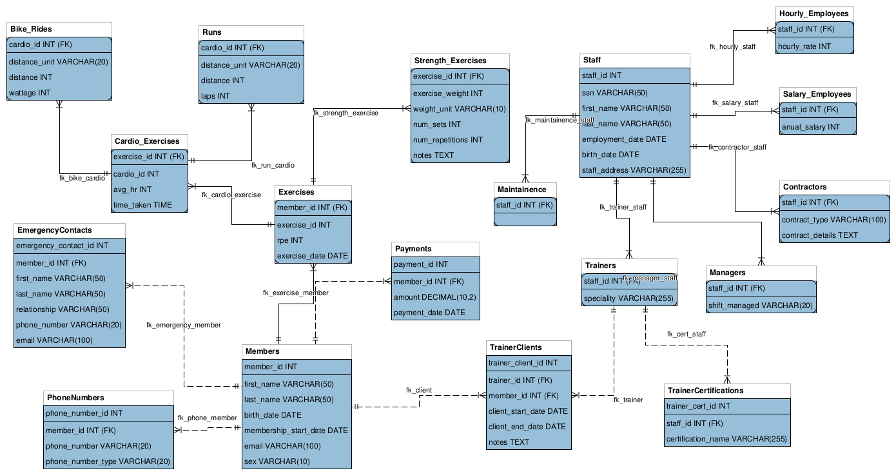

# **Gym Management System**  
Isaac Stephens [Junior, Computer Science, CS Department, Missouri S&T, issq3r@mst.edu]  

For CS2300 "File Structures and Database Systems"

---

Please reffer to **BUILD.md** for implementation.

## Introduction  
The goal of this project is to design and implement a **Gym Management System** using relational modeling and SQL integration in a desktop application. Many gyms need a structured way to track members, staff, and workouts. Members may also want to view their own progress over time.  

This project will focus on creating a **relational database** and a single application interface. The core implementation will support Create, Read, Update, and Delete (CRUD) operations and relational queries, while optional features (stretch goals) will showcase advanced functionality if time allows (or even as a continuation past the end of this class).  

---

## Functional Requirements  

### Core Administrator/Member Functions  
- **Member Management**: Add, update, and remove member records (name, contact information, emergency contact information, membership details).  
- **Staff Management**: Record staff information (name, role, schedule).  
- **Membership Tracking**: View membership type, start and expiration dates, and payment status.  
- **Workout Records**: Allow members (or just admins in the core) to log exercises, values (e.g. weight lifted, distance run), and dates.  

**Basic Queries:**  
- List expiring memberships within the next 30 days.  
- Retrieve workout history for a specific member.  
- Identify active vs. inactive members.  

### Stretch Functionality Goals  
- **Reports**: Aggregate data such as “Most active members” or “Average attendance per month.”  
- **Equipment Tracking**: Store records of gym equipment and maintenance schedules.  
- **Leaderboards**: Rank members by personal records (e.g. heaviest lift, longest/fastest run).  
- **Dual Interfaces**: Implement both a desktop administrator application and a member-facing web application.  

---

## Deliverables  
- **E-R Diagram** and SQL schema implementation.  
- **Application Interface** that connects to and manages the database. *(Planned implementation in C++ using Dear ImGui and Vulkan, subject to change based on feasibility).*  
- **Sample Dataset** for testing CRUD operations and queries.  
- **Documentation** explaining design decisions, schema, and how to use the system.  
---
# Diagram
