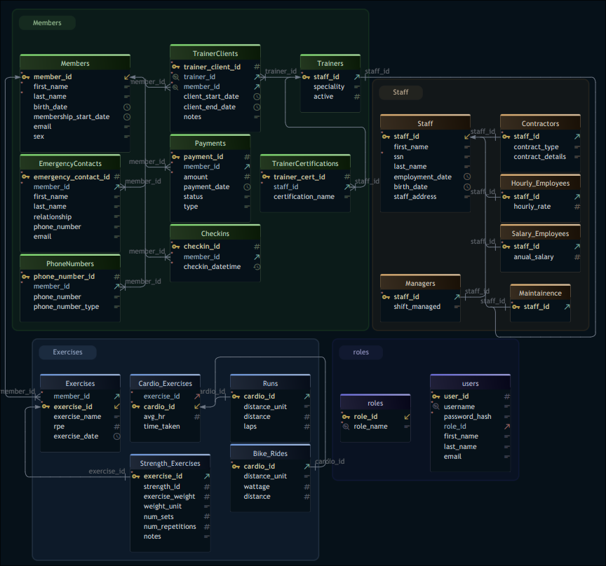

# GymMan - The Gym Management System
**Author:** Isaac Stephens  
**Course:** CS 2300 — File Structures and Database Systems  
**Institution:** Missouri S&T

---

## Overview

GymMan is a full-stack **web-based Gym Management System** built using **Flask**, **MariaDB**, and standard web technologies.  
The project began as a planned desktop ImGui/Vulkan application but fully pivoted to a **web interface** to better support the scale and complexity of the database system.

This application provides a structured way for gym owners, staff, trainers, and members to manage essential gym operations, from member onboarding to trainer assignments to exercise tracking and financial reporting.

## Installation & Local Setup

### See [BUILD.md](documentation/BUILD.md) for instructions.

System Requirements:
- Debian / Ubuntu-based Linux
- Python 3.10+
- MariaDB 10.6+
- pip / python3-venv

## Current Status

GymMan has matured into a fully functional multi-role management system with a complete authentication pipeline, role-based dashboards, membership management, trainer-assignment tools, exercise logging, and integrated payment tracking. Most core backend operations are implemented and verified through the live demo at `isaacstephens.com/gymman-login`.

✔ Fully implemented login, signup, session management, and secure password hashing  
✔ Complete multi-role architecture (Owner, Staff, Trainer, Member)  
✔ Owner, Staff, Trainer, and Member dashboards implemented  
✔ Functional membership management (CRUD) with phone numbers and emergency contacts  
✔ Member check-in system with recent-history tracking  
✔ Staff and trainer registration pipelines implemented  
✔ Trainer–client assignment system implemented  
✔ Exercise logging system (strength + cardio) including Runs and Bike Rides  
✔ Exercise modification and deletion implemented  
✔ Payment creation and revenue aggregation implemented  
✔ Aggregation queries for RPE, max weight, distances, and revenue  
✔ All backend SQL query models implemented in models.py  
✔ Database schema fully deployed in MariaDB  
✔ Load-more pagination for check-ins  
✔ Flash messaging, form validation, and input handling  
✔ Deployed demo at: https://isaacstephens.com/gymman-login

`WIP` UI pages for some views (payments, reports, admin pages)  
`WIP` Exercise browsing UI for member / trainer  
`WIP` Error logging and visibility tools  
`WIP` Advanced trainer reporting pages  
`WIP` Payment completion workflow (mark as completed, staff approval, etc.)

## Core Features (Partially Implemented)

See the full functional requirements in
[Database Functional Requirements](gymman-demo/db_functional_req.md) 

## User Roles Overview

| Role    | Capabilities |
|---------|--------------|
| **Owner**   | Full system access: manage members, staff, trainers, payments, exercises, reports |
| **Staff**   | Manage memberships, payments, check-ins |
| **Trainer** | View assigned clients, log workouts, review performance |
| **Member**  | View profile, workouts, payments, and membership status |

## Database Architecture

The database enforces:

- **Referential integrity** with ON DELETE CASCADE behaviors  
- **Super-type/sub-type modeling** for Staff and Exercises  
- **Specialized cardio subtypes (Runs, Bike_Rides)**  
- **Unique trainer–member pairings**  
- **Check constraints** for units, RPE ranges, positive distances, etc.  

A full ER and logical schema is included in `documentation/`:



## Project Structure
```
Gym-Manager/
├── gymman_install_DEBIAN.sh
├── LICENSE
├── README.md
├── documentation/
│   └── BUILD.md
├── gymman-demo/
│   ├── db.env
│   ├── db_functional_req.md
│   ├── main.py
│   ├── venv
│   └── website/
│       ├── auth.py
│       ├── db.env
│       ├── __init__.py
│       ├── models.py
│       ├── passwords.env
│       ├── __pycache__
│       ├── static
│       └── templates
└── scripts
    ├── create_gymman_tables.sql
    └── gymman_demo_source.sql
```

## Tech Stack

| Layer | Tech |
|-------|------|
| **Frontend** | HTML, CSS, Jinja2 templates |
| **Backend** | Flask (Python 3.13) |
| **Database** | MariaDB |
| **Auth** | Flask sessions, hashed passwords |
| **Server Deployment** | Gunicorn, Nginx reverse proxy |
| **Misc** | Cloudflare Tunnels, Linux (Debian) |

## Security Notes

- Passwords are stored using secure hashing (`werkzeug.security`).
- All database operations use parameterized queries to prevent SQL injection.
- Sessions use Flask’s built-in secure cookie system.
- This is a **demo and academic project** and is not intended for production use without further hardening (HTTPS enforcement, rate limiting, CSRF protection, audit logging, etc.).

